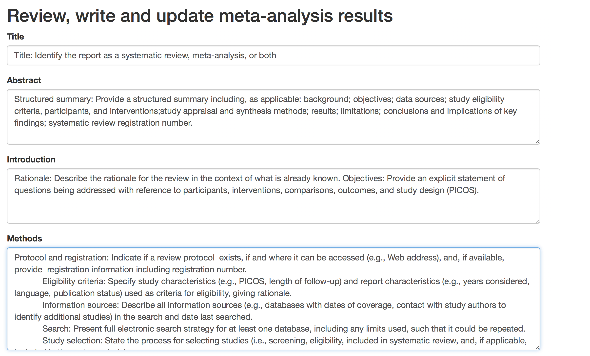
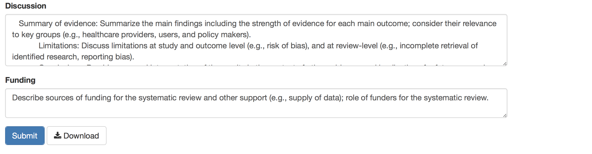
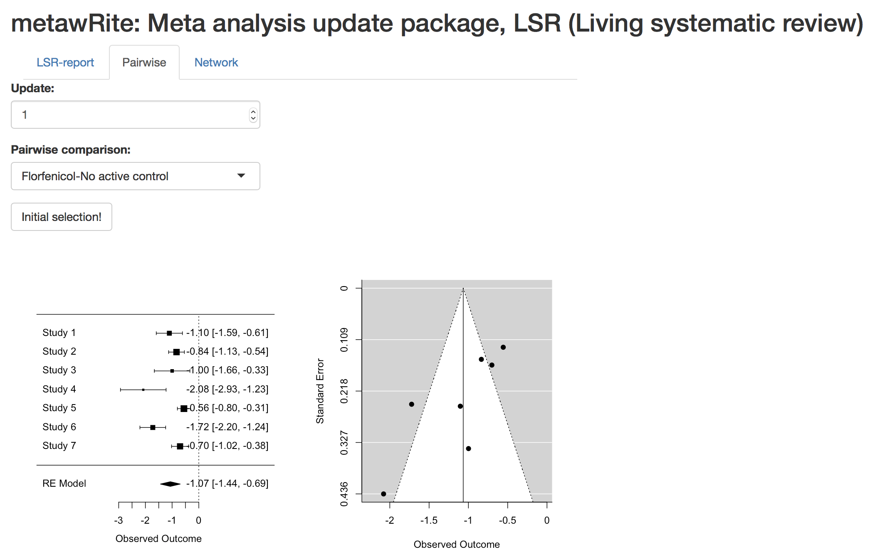
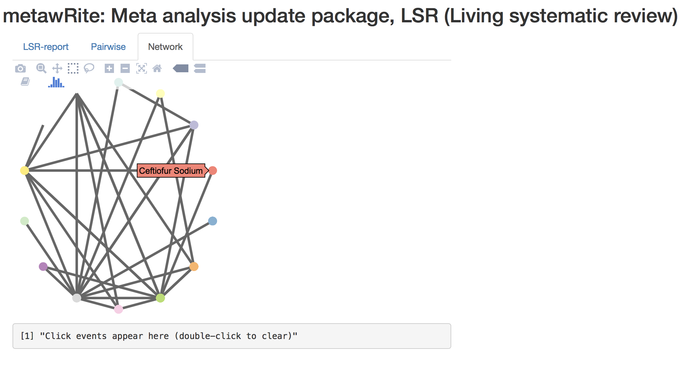
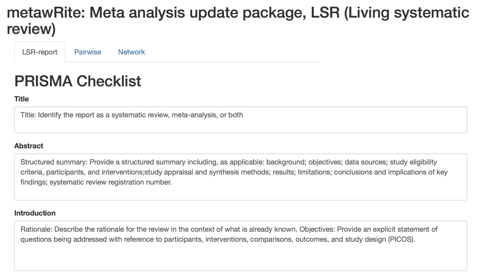

## Project info

Project title: metawRite, Meta analysis update package, LSR (Living systematic review). 

Project short title (30 characters): metawRite

URL of project idea page: 
[metawRite-project](https://github.com/rstats-gsoc/gsoc2017/wiki/metawRite:-Meta-analysis-update-package,-LSR-(Living-systematic-review>))

## Bio of Student 

I'm a Ph.D. candidate in Statistics at Iowa State University (ISU) and my major professor is  Dr. D. Cook. My Ph.D. project relates to bagged projection methods for supervised classification in big data. I have been working with R for the past 10 years. I have experience using shiny ([shiny_PPforest](https://natydasilva.shinyapps.io/Shinyppforest/), [shiny_mosquito](https://natydasilva.shinyapps.io/shiny_msq/) and [shiny_poverty](https://ndasilva.shinyapps.io/shiny-pov/) and writing R packages ([PPforest](https://github.com/natydasilva)). My recent projects are available on my github account ([My-Github](https://github.com/natydasilva)).


I completed my M.S. in Statistics at Iowa State University working in network meta-analysis with Bayesian inference in Spring 2014. From my M.S. thesis work, I published the paper "Mixed treatment comparison meta-analysis of porcine circovirus type 2 (PCV2) vaccines used in piglets" available in ([paper-meta-analysis](http://www.sciencedirect.com/science/article/pii/S0167587714003444)). I have worked on several meta-analysis projects as an Research Assistant with Dr. Annette O'Connor who is based at the College of Veterinary Medicine at Iowa State University. On my webpage you can find other publications I have been involved in including several meta-analysis. ([My-webpage](http://ndasilva.public.iastate.edu/page.html))
 
My experience with R and meta-analysis provide unique qualifications for this project and I would like to work in this project as part of GSOC 2017.

## Contact Information 

Student name: Natalia da Silva

Student postal address: 118 University Village unit E

Telephone: 515-357-3777 

Email: ndasilva@iastate.edu

Skype: pacocuak 

## Student affiliation

Institution: Iowa State University

Program: PhD in Statistics

Stage of completion: I'm PhD candidate writing the dissertation.

Contact to verify: Dianne Cook dicook@monash.edu 

## Mentors

Mentor names: Heike Hofmann and Annette O'Connor 

Mentor emails: hofmann@iastate.edu, oconnor@iastate.edu 

I have talked with the mentors about the project and I we plan to schedule  weekly meetings with them at ISU to work in this project during the summer.

## Coding Plan and Methods

### Project Introduction 

Systematic reviews are an approach to research synthesis used by public health agencies such as the World Health Organization to understand how treatments are effective and approach to disease control. Systematic reviews in the literature often include a meta-analysis that summarizes the findings of multiple studies. It is critical that such reviews are updated rapidly as new scientific information becomes available, so the best evidence is used for the best advice. However, the current peer-reviewed journal based approach to publishing systematic reviews means that reviews can rapidly become out of date and updating is often delayed by the publication model. Living systematic reviews have been proposed as a new approach to dealing with this problem. The main concept of a living review is to enable rapid updating of systematic reviews as new research becomes available, while also ensuring a transparent process and reproducible review ([LSR](http://dx.doi.org/10.1371/journal.pmed.1001603
))

**metawRite** package have the objective to simplify the review, write and update in a systematic review. This package will be an approach to do a living systematic review easily and available for all.
 The  goal is to combine in the package, the writing and analysis of the review that also enables versioning and updating. This package will allow an easy and effective way to display a living systematic review available in a web-based display. 

Three main tasks are needed to have an effective living systematic review; the ability to produce dynamic reports, availability online with an interface that enables end users to understand the data and the ability to efficiently update the review(and any meta-analysis) with new research seamless.

**metawRite** will cover these three task integrated in a friendly web based environment for the final user. This package is not a new meta analysis package instead will be flexible enough to read different output models from the most used meta-analysis packages in R, organize the information and display the results in an user driven interactive dashboard. The main function of this package will display a modern web-based application for update a living systematic review.
This package combines the power of R and shiny to get a dynamic reports and up to date meta-analysis results remaining user friendly. The package has the potential to be used by a large number of groups that conduct and update systematic review such as What Works clearing house (WWC) – which reviews education interventions, Campbell Collaboration (cambell-collaboration) that includes reviews on topics such as social and criminal justice issues and many other social science topics, the Collaboration for Environment Evidence (environment-evidence) and food production and security (syreaf). 


### Details to complete the work

To complete this project I plan to split my work in three main components:

1. Data transformation and results computations.

 In this part I will write functions to facilitate the data transformation and manipulation to run classic pairwise meta-analysis. 
 To fit classic meta-analysis models I will use initially  **metafor** and **meta** packages.
 The idea is to make available functions to facilitate the analysis to the final user of our application. 
For example, `pairwise_metafor` will be a function to restructure data and run pairwise meta-analysis results using  **metafor** package. The model output will be saved in an .rda with a list structure. The data generated in this step will be the main inputs for the final shiny app. 

In a similar way `pairwise_meta`  will restructure the data and run pairwise meta-analysis but using **meta** instead of **metafor** package to fit the model.


The package documentation will be done using **roxygen2** package, below I show the help example for `pairwise_meta` function.
```{r}
#' @usage pairwise_metafor(dataini, ...)
#' @param dataini Data frame in an arm-based format (e.g. input format for WinBUGS)
#' @param ... optional argument to functions, you can include any parameter to run rma 
#' function from metafor pkg
#' @return returns two .rda one with the data set in contrast-based format and the 
#' second .rda is a list with the pairwise meta-analysis for each update and each pair of treatments.
```

2. Writing dynamic reports

A key characteristic of a living systematic (LSR) review is the ability to produce dynamic reports. 
To get reproducible and dynamic reports I will use **knitr** package. A second main task in LSR is to make the reports available online with an interface that enables end users to understand the data and the ability to efficiently update the review. I will use **shiny** combined with **knitr** to get this second functionality.
Here the challenge will be the persistent storage for the different versions. The storage can be local or remote and there are a lot of different approaches to do this.  At initial stage I will design the package to get local persistent storage but I think maybe will be more appropriate to do a remote storage.


The final user will be able to write the report in a shiny app, the first *tabsetPanel* will contain a standard report structure using `textAreaInput` in the user-interface (`ui`). 
In this `tabsetPanel` the user will write the report using **knitr**, save it and be able to download the pdf file. After the first submission the user will be able to see the previous report versions and change it as they need it. To do this I will use **shinyjs** package. 

The first `tabsetPanel` should look like this for the first submission:

<!--   -->


At the end of the tabset should be available two options, one to submit the version and other two download the pdf version that should be compile using **knitr**:

 <!--   -->
  

After submission the first tabset will be updated and a version selection will be available 


 <!--  -->


3. Visualization and summary information

 With the model results from pairwise meta-analysis or network meta analysis (if this is available) summary results will be presented. A second tabsetPanel containing the results 
 With the model information some interactive visualizations will be available using **ggplot2**, and **plotly** to get interactive graphs. All the visualization will be presented in a dashboard using **shiny**. 


In the following screenshot I present an initial visualization for a pairwise meta-analysis. These are a forest plot and a funnel plot.
 <!--  -->

 

If network meta-analysis applies for the specific case, some visualizations will be available to summarize the model results. A  possible data visualization for the network meta-analysis is shown below using  **geomnet**  and **plotly** I can direct translate a **ggplot2** object into an interactive graph.


<!--  -->

 -->


The final user will get a web application using **shiny** with three modules or tabsets as a main result, 

-	Report: this first `tablsetPanel` will display an environment to make an interactive report using kntr. You will write your update report in the web application to be available online and the user can download the report in different formats as they need it. Also the previous reports will be available to be modified using the shiny interactive functionalities.

-	Pairwise meta-analysis: In this second tabset the main results from a pairwise meta-analysis will be displayed. The user can interact in the application to self discover the main results, selecting the update results and treatments to explore. Model fit and interactive plots will be available.

-	Network meta-analysis: If network meta analysis is needed this third tabset will be available. The main results from a network meta-analysis will be displayed. The user can interact in the application to self discover the main results, selecting the update results to explore. Model fit and interactive plots will be available.


<!--   -->
 


\newpage

## Timeline

Student coding period 30 May - 29 Aug

Period        | Activity
------------------ | ------------------------------------------
30 May - 30 June  | Write helper functions to data transformation and model results computations. Initial work on visualization and summary information.
30 June - 24 July | Writing dynamic reports and finish with visualization and summary information
24 July - 29 Aug | Include all the pieces in the final shiny app

It is important to mention that I will write the package documentation and vignette simultaneously with the development of each function.
The package will be tested in each stage and I will use **Travis CI** to build and test my package that will be  hosted at GitHub.


## Management of Coding Project

The project will be available on my github account: https://github.com/natydasilva/metawRite
This will be a convenient way to share the updates with my mentors and they can make the comments and suggestions there.

## Test

All the screenshots shown before are part of my test solution.
In this link you will find my advance in the project https://github.com/natydasilva/metawRite .

## Final comment

I would love to be accepted in GSOC2017 for this project. I think will be a great experience that I would like to share with my colleagues and students in the future. 


## Management of Coding Project dfasdf


dfasdfads


